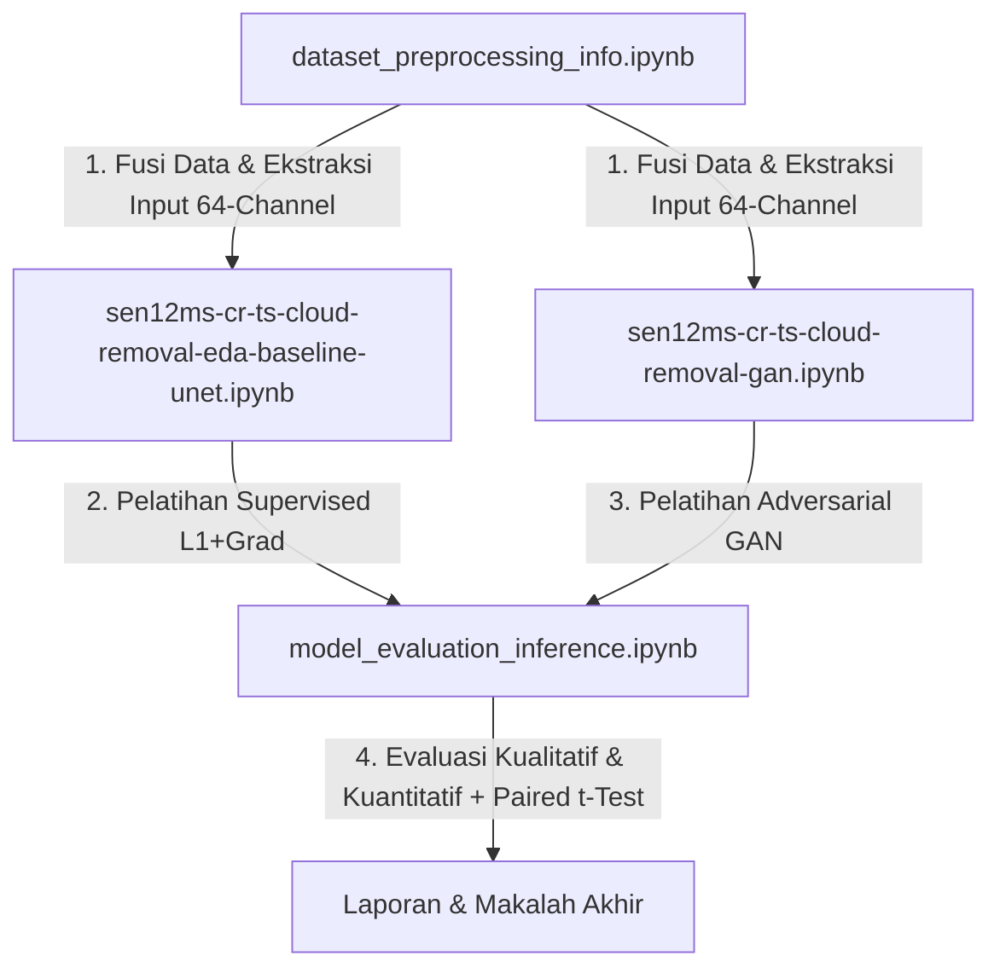

# Pembersihan Awan Citra Satelit Multi-Temporal Menggunakan Model ResUNet dan GAN (Studi Kasus: asiaWest_n)

Repositori ini dikembangkan untuk mendokumentasikan kode pemrograman, alur preprocessing, pelatihan model, serta evaluasi dalam pengerjaan Tugas Akhir mengenai restorasi citra satelit Sentinel-2 yang tertutup awan dengan bantuan radar Sentinel-1 pada wilayah Asia Barat (`asiaWest_n`).

---

## 1. Mengapa Penulis Memilih Pendekatan & Model Ini?

Restorasi citra satelit dari tutupan awan tebal merupakan tantangan besar dalam penginderaan jauh optik. Penelitian ini menerapkan fusi data multi-sensor dan deep learning dengan alasan logis berikut:

### A. Fusi Multi-Sensor (Sentinel-1 SAR + Sentinel-2 Optik)
* **Sentinel-2 (Optik)** sangat rentan terhadap tutupan awan, sehingga sering kali kehilangan informasi spektral permukaan bumi.
* **Sentinel-1 (Radar SAR / Synthetic Aperture Radar)** menggunakan gelombang mikro yang mampu menembus awan dalam kondisi cuaca apa pun. Data SAR memberikan informasi geometri permukaan bumi yang konsisten sebagai pemandu rekonstruksi citra optik yang hilang.

### B. Arsitektur Multi-Temporal ResUNet
* **Arsitektur U-Net** memiliki struktur encoder-decoder dengan *skip-connections* yang sangat baik dalam menjaga detail spasial frekuensi tinggi (seperti bentuk jalan, batas lahan, dan struktur pemukiman) dari input ke output.
* **Residual Blocks (ResNet)** ditambahkan untuk mencegah masalah hilangnya gradien (*vanishing gradient*) pada jaringan yang dalam. Ini mempermudah konvergensi model saat memproses input kompleks berukuran besar (tensor fusi 64-channel).
* **Pendekatan Multi-Temporal** memanfaatkan deret waktu perekaman citra (4 tanggal berbeda) agar model dapat mempelajari perubahan temporal bumi guna mengisi area berawan secara konsisten.

### C. Pendekatan Generative Adversarial Network (GAN)
* Pelatihan model secara *supervised* menggunakan fungsi loss standar (seperti L1/L2 Loss) cenderung menghasilkan citra yang agak kabur (*blurry*). Hal ini dikarenakan loss matematis tersebut meminimalkan rata-rata kesalahan piksel (efek *regression-to-the-mean*).
* **GAN** memecahkan masalah ini dengan menambahkan **Adversarial Loss** (Hinge Loss) melalui Diskriminator. Diskriminator memaksa Generator untuk memproduksi visual yang tajam, realistis, dan detail, bukan sekadar nilai rata-rata piksel yang kabur.
* **ResNet-18 dengan Spectral Normalization** digunakan pada Diskriminator untuk membatasi konstanta Lipschitz jaringan, sehingga menjaga stabilitas pelatihan adversarial dan menghindari terjadinya *mode collapse*.

---

## 2. Alur dan Urutan Langkah Eksperimen

Pengerjaan penelitian ini dilakukan secara runut melalui 4 tahap utama yang direpresentasikan oleh 4 notebook di dalam repositori ini:

### Langkah 1: Preprocessing Spasial & Pembuatan Input (`dataset_preprocessing_info.ipynb`)
* **Tujuan**: Mempersiapkan data mentah dari satelit Sentinel-1 dan Sentinel-2 agar siap dimasukkan ke model deep learning.
* **Proses**:
  * Melakukan normalisasi data Sentinel-2 (dibagi 10000.0) dan Sentinel-1 (skala linear desibel).
  * Membuat peta probabilitas awan (Cloud Probability Map) berbasis informasi spektral dan temporal.
  * Menggabungkan seluruh saluran tersebut menjadi tensor masukan berukuran `[64, 256, 256]` (13 band S2 + 2 band S1 + 1 band Cloud Map x 4 tanggal temporal).

### Langkah 2: Pelatihan Model Baseline ResUNet (`sen12ms-cr-ts-cloud-removal-eda-baseline-unet.ipynb`)
* **Tujuan**: Melatih model pembanding (Baseline) berbasis rekonstruksi piksel langsung.
* **Proses**:
  * Melatih generator Multi-Temporal ResUNet di Kaggle menggunakan kombinasi L1 Loss (MAE) dan Gradient Loss untuk memulihkan piksel secara matematis.
  * Model ini menghasilkan akurasi piksel spektral tertinggi (~98.9%), namun citra rekonstruksinya cenderung agak halus/kabur di bawah awan tebal.

### Langkah 3: Pelatihan Model GAN (`sen12ms-cr-ts-cloud-removal-gan.ipynb`)
* **Tujuan**: Melatih model berbasis generative adversarial untuk mengembalikan ketajaman visual permukaan bumi.
* **Proses**:
  * Melatih Generator (Multi-Temporal ResUNet) bersama Diskriminator (ResNet-18 dengan Spectral Normalization) di Kaggle menggunakan gabungan Adversarial Hinge Loss, L1 Loss, dan Gradient Loss.
  * Model ini menghasilkan visual spasial yang jauh lebih tajam dan realistis (tekstur sawah, pemukiman, dan jalan pulih dengan baik).

### Langkah 4: Evaluasi Statistik & Inferensi (`model_evaluation_inference.ipynb`)
* **Tujuan**: Menganalisis hasil dari kedua model secara ilmiah dan objektif untuk bahan sidang/laporan.
* **Proses**:
  * Menghitung metrik performa: MAE, RMSE, PSNR, SSIM, dan Korelasi Pearson.
  * Melakukan **Uji t Berpasangan (Paired t-test)** untuk menguji signifikansi perbedaan performa kedua model.
  * Menganalisis *Perception-Distortion Trade-Off* di mana Baseline unggul secara metrik numerik (~0.2% lebih akurat), tetapi GAN jauh lebih unggul dalam persepsi visual manusia (tidak kabur).

---

## 3. Dokumen Hasil Akhir

Selain kode program, repositori ini juga memuat dokumen resmi Tugas Akhir yang telah diselesaikan:
1. **`Laporan dari Penyuka Idol Banyak Makan.docx`**: Buku Laporan Tugas Akhir lengkap (berisi Bab I sampai Bab V, grafik kurva pelatihan, serta seluruh 32 Lampiran kode pemrograman dan visualisasi).
2. **`Makalah dari Penyuka Idol Banyak Makan.docx`**: Naskah ringkas Artikel Ilmiah / Makalah (6-8 halaman) yang siap disubmit untuk publikasi jurnal atau prosiding seminar.

---

## Ucapan Terima Kasih (Acknowledgements)

Penulis menyampaikan rasa terima kasih dan penghargaan yang setinggi-tingginya kepada pihak-pihak yang telah mendukung penyelesaian Tugas Akhir ini:
* **Ibu Dr. Dra. Kartika Fithriasari, M.Si.** selaku Dosen Pembimbing, atas arahan, bimbingan, kesabaran, dan masukan berharga sepanjang pengerjaan penelitian ini.
* **Bapak Prof. NUR Iriawan, M.Ikomp, Ph.D** dan **Ibu Tintrim Dwi Ary Widhianingsih, S.Si, M.Stat, Ph.D** selaku Dosen Penguji, atas kritik, saran, koreksi, dan masukan yang sangat bermanfaat untuk penyempurnaan Tugas Akhir ini.
* **Fikri** selaku sahabat dekat, yang secara khusus penulis ucapkan terima kasih karena telah berbaik hati memfasilitasi kediaman/tempat berkumpul untuk pengerjaan Tugas Akhir ini hingga penulis menginap berhari-hari demi menyelesaikan penelitian ini.
